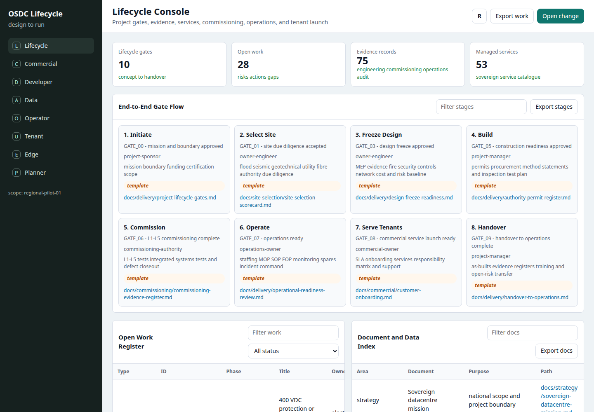
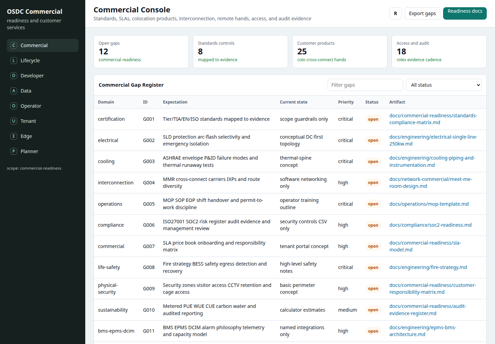
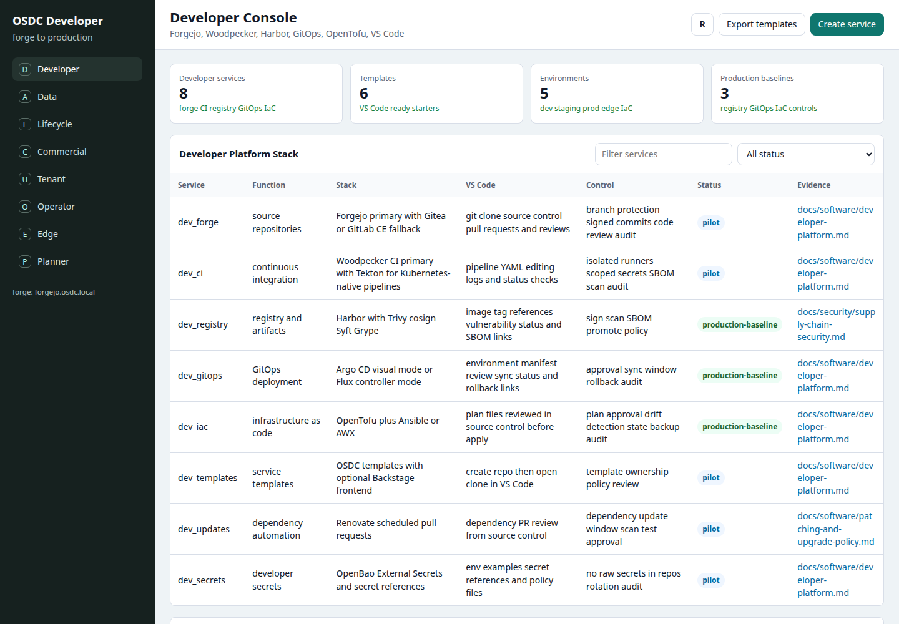
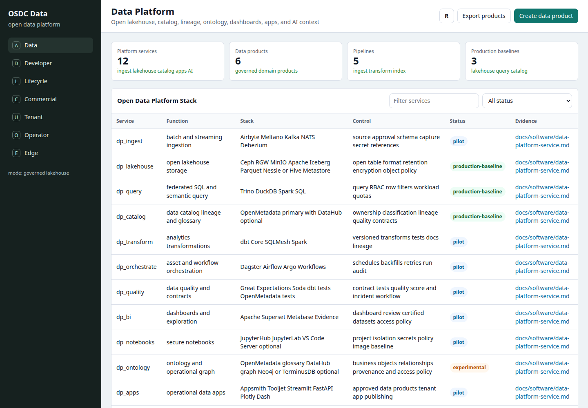
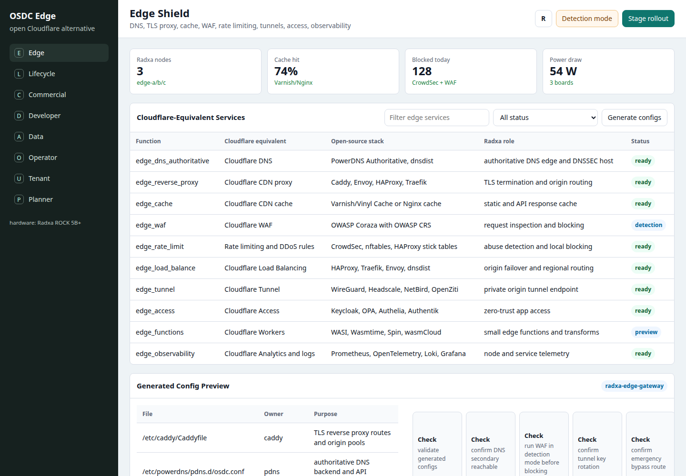
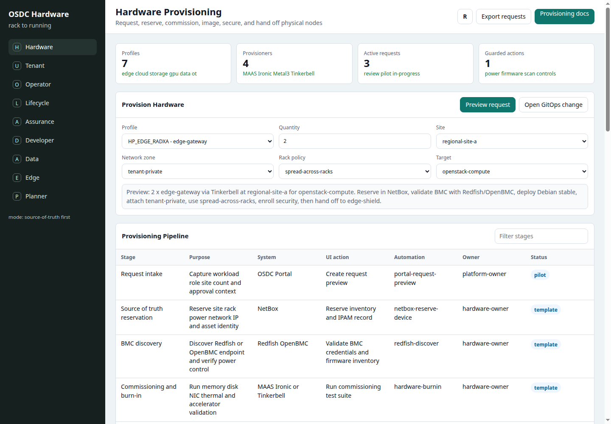
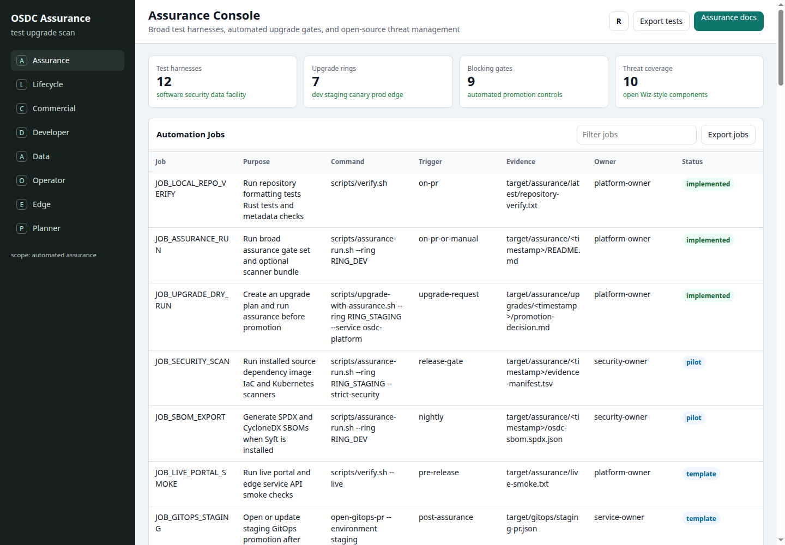

# Open Source Data Centre

Open Source Data Centre is a reference architecture, software stack, mechanical design system, and procurement toolkit for countries that need sovereign, sustainable, affordable datacentres.

The project is designed for developing-world governments, universities, public-sector clouds, national AI programmes, hospitals, telecom operators, and regional infrastructure companies that need to host sensitive data locally without becoming permanently dependent on hyperscalers, proprietary datacentre vendors, or closed management platforms.

The goal is not to build a fragile "cheap datacentre."

The goal is to make reliable, maintainable, auditable datacentre infrastructure that can be built in stages, operated by local engineers, repaired with documented parts, powered partly by local renewable energy, and expanded from a 50 kW edge site to a national AI-ready sovereign cloud.

**Mission:** build sovereign cloud capacity that countries can own, understand, repair, expand, and power sustainably.

The project combines:

- Building systems for DC-powered HVAC auxiliaries, lighting, physical security, solar power, sodium-ion storage, and earth-based cooling.
- FreeCAD 1.1 design artifacts for mechanical parts, racks, adapters, cable paths, and serviceable assemblies.
- Flexible rack patterns for 19-inch EIA, Open19, OCP Open Rack V3, and Open Rack Wide where appropriate.
- A Rust-based unified control plane for lifecycle delivery, inventory, observability, cost modelling, scheduling, workflow automation, and user/admin interfaces.
- Open-source infrastructure stacks for bare metal, Kubernetes, storage, networking, monitoring, identity, AI serving, and job queueing.
- Test harnesses and operational guidance for building systems, IT systems, AI workloads, and cost calculators.

## What This Repository Produces

| Output | Purpose |
| --- | --- |
| Reference architectures | 50 kW, 250 kW, 1 MW, and 5 MW sovereign datacentre deployment patterns. |
| BOM and cost calculators | Country-specific CAPEX/OPEX, import duty, local labour, spares, energy, water, carbon, outage, and fallback-fuel planning. |
| FreeCAD / IFC / STEP design system | Buildable structures, racks, adapters, service trenches, thermal spines, cable trays, and serviceable parts. |
| Commissioning and reliability pack | L1-L5 commissioning, grid-loss, DC-bus ride-through, cooling failover, generator-start, and backup-restore tests. |
| Operator training pack | Local skills, runbooks, spares lists, maintenance schedules, emergency procedures, staffing, and escalation paths. |
| Commercial readiness pack | Gap register, standards matrix, SLA model, colocation products, cross-connect workflows, audit evidence, and customer responsibility boundaries. |
| Delivery control pack | Project lifecycle gates, authority permits, owner-engineer review, design freeze, operational readiness, handover, risk, action, and commissioning evidence registers. |
| Sovereign cloud service catalogue | Open-source cloud, edge, security, developer, data, AI, observability, backup, and operations services under one portal/API. |
| Unified infrastructure workbench | Browser front door for guided infrastructure requests, selected deployment stack, connector paths, required tests, blocking gates, automation jobs, and evidence targets. |
| Hardware provisioning control plane | Source-of-truth-first rack-to-running workflow using NetBox, Redfish/OpenBMC, MAAS, Ironic, Metal3, Tinkerbell, security enrolment, and assurance closeout. |
| Sovereign developer platform | Forgejo-style repos, CI, Harbor registry, GitOps deployment, OpenTofu IaC, promotion gates, service templates, and VS Code-ready developer workflows. |
| Data Platform as a Service | Optional open-source Foundry-like layer for governed data products, lakehouse tables, catalog, lineage, ontology objects, dashboards, apps, notebooks, and AI context. |
| Assurance and upgrade fabric | Broad test-harness catalogue, automated upgrade rings, blocking gates, scanner coverage, and evidence bundles. |
| Open threat management platform | Open-source Wiz-like scanner and risk-management layer using DefectDojo, Dependency-Track, Trivy, Grype, OSV-Scanner, Wazuh, Falco, Kubescape, OpenVAS, OpenSCAP, and related tools. |
| Edge Shield security fabric | Sovereign DNS, TLS, CDN cache, WAF, rate limiting, private tunnels, zero-trust access, logs, metrics, secrets, policy, and audit. |
| Unified lifecycle console | Browser surface that composes design gates, permits, evidence registers, commissioning, operations, sovereign services, config scripts, and repo documents from the existing CSV/doc sources. |
| Prototype browser config management | Web-based editing of sample tool config scripts, with the production path defined as validation, GitOps review, staged rollout, rollback checks, and audit. |

## What This Project Is

- A reference architecture for sovereign, sustainable datacentres.
- A practical build path from 50 kW edge sites to national AI-ready infrastructure.
- A set of open BOMs, calculators, software adapters, mechanical designs, and commissioning tests.
- A way for countries to reduce dependency on closed cloud platforms and proprietary datacentre management stacks.
- A national implementation manual for cloud capacity that can be operated and repaired locally.

## Strategic Position

OSDC is not an alternative to OpenStack, CloudStack, OpenNebula, Proxmox, Kubernetes, Ceph, NetBox, MAAS, Foreman, SONiC, OpenBMC, OCP, or Open19.

It is the missing sovereign datacentre integration layer above and around them:

```text
country build path + lifecycle console + commercial readiness
        |
OSDC policy, cost, evidence, approvals, GitOps, audit
        |
OpenStack / CloudStack / Proxmox / Kubernetes / Ceph / NetBox / MAAS / Ironic / Metal3 / Keycloak / OpenBao / PowerDNS / Wazuh
```

Mature infrastructure projects own the specialist layers. OSDC owns the national implementation model: which systems to combine at each scale, how they are commissioned, how they are made commercially credible, how changes are approved, how evidence is captured, and how operators manage them through one sovereign portal.

## What This Project Is Not

- It is not a certified datacentre design.
- It is not a substitute for licensed local engineers, fire engineers, electrical engineers, code approval, or authority review.
- It is not a promise that marketplace parts are safe, compliant, or suitable for life-safety and critical-power systems.
- It is not a hyperscaler clone.
- It is not a replacement for OpenStack, CloudStack, Proxmox, Kubernetes, Ceph, NetBox, MAAS, Foreman, SONiC, OpenBMC, or OCP.
- It is not a Cloudflare clone or a claim to reproduce global anycast/DDoS capacity.
- It is not a reason to skip commissioning, documentation, training, spare parts, security review, or disaster recovery.

## Design Principles for Sovereign Datacentres

1. **Sovereignty first** - data, encryption keys, logs, backups, identity, and admin control must remain under national or institutional control.
2. **Open where possible** - use open-source software, open standards, documented APIs, and exportable data models.
3. **Local maintainability** - every critical system needs a local spares plan, local training path, and second-source plan.
4. **Simplify topology, not safety** - reduce unnecessary vendor complexity, but do not reduce fire, electrical, commissioning, or operational safety.
5. **Energy-aware by design** - power availability, solar integration, storage, cooling efficiency, and workload scheduling are core design inputs.
6. **Upgradeable path** - start with 19-inch commodity racks and grow toward Open19, OCP Open Rack V3, or Open Rack Wide where the supply chain can support it.
7. **No false certification claims** - describe Tier II/Tier III-like design intent, but do not claim Uptime Tier certification unless formally audited.

## Deployment Ladder

| Stage | Use case | Main goal | Likely software substrate |
| --- | --- | --- | --- |
| **50 kW edge micro** | University, hospital group, ministry edge, ISP edge | Prove local operation and sovereign services. | Proxmox VE or CloudStack, Ceph/ZFS, NetBox/openDCIM, PowerDNS, Edge Shield. |
| **250 kW regional pilot** | First serious public-sector cloud | Validate power, cooling, cloud stack, operators, costs, and commissioning discipline. | CloudStack or OpenStack, Ceph, Kubernetes, NetBox, MAAS/Ironic/Metal3, Keycloak/OpenBao, Forgejo/Harbor/GitOps. |
| **1 MW regional production** | National health, education, government apps, research | Deliver reliable sovereign cloud capacity. | OpenStack, Ceph, Kubernetes with Kueue/Slurm, NetBox, Wazuh/Falco/Suricata/Zeek, full lifecycle registers. |
| **5 MW national/AI-ready** | National AI, HPC, larger public cloud | Build strategic compute infrastructure. | OpenStack/Ironic/Metal3, Ceph NVMe tiers, Kubernetes, Slurm/Kueue, OpenBMC/Redfish, SONiC where supportable, OCP/Open19 profiles. |

The flagship developing-world pilot is the 250 kW regional design: 10 racks at 25 kW average, N+1 pumps and controls, DC-first solar sodium-ion microgrid, fallback generator path, open-source management stack, and local fabrication where safe.

## Architecture At A Glance

```text
             OSDC Unified Portal
        Rust API / policy / audit / cost
                    |
 +------------------+------------------+
 |                  |                  |
Tenant UI       Operator UI        Security UI
 |                  |                  |
VMs/K8s/AI      racks/power/DCIM    SIEM/WAF/IAM
 |                  |                  |
OpenStack       NetBox/openDCIM     Wazuh/Falco/OPA
Kubernetes      Prometheus          Keycloak/OpenBao
Ceph            Grafana             Edge Shield
Harbor          Velero              Coraza/CrowdSec
Argo/Flux       Cilium              Suricata/Zeek
```

The Rust layer does not replace mature infrastructure systems. It provides the unified portal/API, lifecycle control plane, policy checks, cost and sustainability calculations, approval flows, config generation, health checks, audit events, and GitOps rollout orchestration.

## Current Maturity

This repository is currently a strong architecture, planning framework, CSV-backed catalogue, and working Rust prototype. It is not yet a deployable national cloud platform.

The current portal is a small standard-library Rust HTTP server with in-process sample data and CSV-backed catalogues. It demonstrates the intended infrastructure workbench, tenant, operator, Edge Shield, config-editor, lifecycle, hardware provisioning, commercial, assurance, developer, data-platform, and planner surfaces, but it is not yet integrated with real Proxmox, CloudStack, OpenStack, Kubernetes, Ceph, Keycloak, NetBox, PowerDNS, OpenBao, Wazuh, Argo CD, Flux, Trino, Iceberg, OpenMetadata, Superset, DefectDojo, Dependency-Track, Kubescape, OpenVAS, OpenSCAP, Falco, Redfish/OpenBMC, MAAS, Ironic, Metal3, Tinkerbell, or MLflow installations.

The next engineering phase is to turn the plan-only adapter contracts into real read-first integrations, starting with PowerDNS, NetBox, Keycloak, OpenBao, GitOps, and one small-site cloud substrate such as Proxmox or CloudStack before deeper OpenStack automation.

Commercial readiness is also early. The repository now tracks the gap between the OSDC blueprint and a commercial colocation or hyperscale-grade datacentre through a gap register, standards/control matrix, SLA model, commercial product catalogue, MEP evidence targets, operations templates, and audit-evidence register. These artifacts are templates and planning controls, not certification evidence until project-specific professionals review and sign them off.

## Portal Screenshots

The screenshots below are captured from the local Rust portal prototype at `127.0.0.1:8787`.

| Lifecycle console | Commercial console |
| --- | --- |
|  |  |

| Developer console | Data platform console |
| --- | --- |
|  |  |

| Edge Shield console | Hardware provisioning console |
| --- | --- |
|  |  |

| Assurance console |
| --- |
|  |

## Local Maintainability Doctrine

A sovereign datacentre is not sovereign if it cannot be repaired locally.

Every critical component must have:

- a documented function;
- wiring or interface drawings;
- at least one second-source option;
- local spare-part classification;
- maintenance interval;
- failure symptom list;
- safe replacement procedure;
- commissioning or post-replacement test.

## Commercial Readiness

Commercial datacentres are judged by evidence as much as by architecture. OSDC therefore tracks:

- certification and standards boundaries;
- MEP drawings, calculations, and commissioning evidence;
- site selection, flood, seismic, geotechnical, utility, fibre, and authority due diligence;
- fire/life-safety and battery safety strategy;
- physical security zones, visitor controls, CCTV retention, loading dock, cage, rack, and break-glass access;
- meet-me room, cross-connect, carrier, IXP, and cloud-on-ramp products;
- customer onboarding, SLAs, service credits, and responsibility boundaries;
- MOP/SOP/EOP discipline, shift handover, permit-to-work, and incident command;
- lockout/tagout, escalation, post-incident review, drills, alarm philosophy, telemetry retention, and capacity management;
- ISO 27001/SOC 2-style audit evidence and supplier-risk management;
- risk register, control evidence, management review, PCI DSS physical-scope, and data-residency evidence templates;
- BMS/EPMS/DCIM integration and OT cybersecurity zones;
- BMS/EPMS segmentation, remote OT access, OT patch/backup, PLC hardening, and facility gateway threat modelling;
- sustainability measurement boundaries, metering, carbon, water, heat reuse, circularity, and battery lifecycle;
- AI-ready rack classes, liquid cooling, GPU networking, energy-aware scheduling, model governance, and tenant isolation.

Machine-readable commercial data lives in [data/commercial](data/commercial/). The main entry point is [Commercial Readiness](docs/commercial-readiness/README.md).

## Hardware Provisioning

The portal now treats physical hardware as a user-requestable but evidence-gated resource. The model is source-of-truth first:

- reserve site, rack, power, cable, IPAM, and asset identity in NetBox;
- validate BMC access, boot mode, firmware inventory, and power actions through Redfish/OpenBMC;
- commission and burn in nodes through MAAS, Ironic, Metal3, or Tinkerbell;
- deploy approved OS images and network profiles;
- enroll Wazuh, OpenBao, monitoring, logging, and scanner controls;
- hand the node to OpenStack, Kubernetes, Ceph, Edge Shield, the data platform, or facility OT;
- close the request only after an assurance evidence bundle exists.

The main docs are [Hardware Provisioning](docs/hardware/hardware-provisioning.md) and [System UI Connectors](docs/architecture/system-ui-connectors.md). Machine-readable data lives in [data/hardware](data/hardware/) and [data/software/system-ui-connectors.csv](data/software/system-ui-connectors.csv). The portal exposes it through `/hardware`, `/api/hardware/provisioning`, and `/api/connectors/systems`.

## Assurance, Upgrades, and Threat Management

OSDC needs broad automated testing for every major function and a unified upgrade path that cannot bypass evidence. The assurance pillar now tracks:

- test harnesses for Rust code, repository metadata, portal APIs, config scripts, GitOps/IaC, supply chain, Kubernetes posture, endpoint compliance, network exposure, runtime detections, data-platform workflows, and facility commissioning;
- upgrade rings for development, staging, canary, production batches, facility controls, Edge Shield, and data-platform releases;
- blocking gates for discovery, build, scan, posture, staging, stateful restore, rollback, approval, and audit;
- scanner coverage for source, dependencies, images, IaC, Kubernetes, hosts, networks, runtime, compliance, and facility OT;
- an open-source Wiz-like threat-management stack using DefectDojo, Dependency-Track, Trivy, Grype, OSV-Scanner, Wazuh, Falco, Kubescape, Greenbone OpenVAS, OpenSCAP, MISP/OpenCTI, and related tools.

The main docs are [Assurance Test and Upgrade Fabric](docs/software/assurance-test-and-upgrade-fabric.md) and [Open Threat Management and Scanner Platform](docs/security/open-threat-management-and-scanner.md). Machine-readable assurance data lives in [data/software](data/software/) and [data/security](data/security/). The portal exposes it through `/assurance` and `/api/assurance/overview`.

Runnable local assurance commands:

```bash
scripts/assurance-run.sh --ring RING_DEV
scripts/upgrade-with-assurance.sh --ring RING_STAGING --service osdc-platform --change-ref PR-123
scripts/assurance-run.sh --ring RING_STAGING --strict-security
```

These commands write evidence under `target/assurance/` so operators can attach the bundle to a GitOps promotion, DefectDojo engagement, Dependency-Track project, Wazuh/OpenSearch investigation, or future OSDC evidence service.

## Delivery and Commissioning Controls

Commercial-grade delivery needs visible gate discipline, not just design documents. OSDC now treats project control as a first-class catalogue:

- lifecycle gates from concept through owner-engineer review, design freeze, procurement, construction readiness, integrated systems testing, operational readiness, and handover;
- authority permits for planning, grid interconnect, fire strategy, environmental, water, telecom/fibre, building-control, generator/fuel, security, and waste approvals;
- design-freeze checks for single-line diagrams, protection coordination, cooling topology, fire strategy, network topology, commissioning scripts, cost model, and risk register;
- owner-engineer independent review checkpoints for power, cooling, controls, fire/life safety, physical security, operations, commissioning, sustainability, AI-ready loads, and commercial products;
- risk and action registers with owner, criticality, status, due date, dependency, and next evidence fields;
- commissioning evidence register for L1-L5 tests, integrated systems tests, blackout/recovery, cooling failover, generator start, backup/restore, access-control, CCTV, alarm, BMS/EPMS/DCIM, and evidence retention;
- operational readiness and handover templates for staffing, training, spares, permits, MOP/SOP/EOP approval, monitoring, backup/restore, DR, customer onboarding, and post-handover defects.

Machine-readable delivery data lives in [data/delivery](data/delivery/) and commissioning evidence data lives in [data/commissioning](data/commissioning/). The main entry points are [Delivery Controls](docs/delivery/README.md) and [Commissioning Evidence Register](docs/commissioning/commissioning-evidence-register.md).

The portal exposes these sources through `/lifecycle` and `/api/lifecycle/overview`. That unified interface composes project gates, risks, actions, gaps, permits, engineering evidence, commissioning evidence, operations procedures, audit evidence, standards controls, service catalogues, config scripts, and key documents into one browser surface.

## Software Position

The software goal is a sovereign cloud user experience over open infrastructure, not a new AWS clone.

```text
User experience:
  AWS-like portal and API

Underneath:
  OpenStack
  Ceph
  Kubernetes
  Kueue
  Slurm
  Keycloak
  OPA
  NetBox/openDCIM
  OpenTelemetry
  Grafana
  Rust adapters
```

Rust owns APIs, adapters, calculators, workflow automation, policy checks, and the unified interface. Mature infrastructure projects own the low-level cloud, storage, identity, telemetry, and scheduling systems.

## Sovereign Cloud Service Catalogue

The repository defines an open-source sovereign cloud service catalogue: identity, compute, storage, networking, edge, developer platform, observability, SOC, data, AI, DCIM, ITSM, backup, and upgrade workflows.

The portal should expose workflows, not every low-level setting:

- create a government tenant;
- issue a secure application endpoint;
- create a VM, Kubernetes cluster, bucket, volume, or PostgreSQL database;
- approve GPU queue access;
- deploy a model endpoint;
- approve an OpenTofu plan;
- patch Keycloak or Cilium through GitOps;
- restore last night's backup;
- show externally exposed services;
- show vulnerable images and non-compliant workloads;
- show which systems are behind on security patches.

The catalogue is built as bundles:

- **Bundle A - Sovereign Cloud Core:** OpenStack or CloudStack, Kubernetes, Ceph, Cilium, Keycloak, OpenBao, OPA/Kyverno, Harbor, OpenTofu, Argo CD or Flux, Prometheus/VictoriaMetrics, Grafana, Loki/Tempo, Velero, and NetBox.
- **Bundle B - Sovereign Edge and Security:** PowerDNS, dnsdist, Caddy/Envoy/HAProxy, Varnish, Coraza, CrowdSec, WireGuard/NetBird/OpenZiti, Wazuh, Falco, Suricata, Zeek, and MISP/OpenCTI.
- **Bundle C - Developer Platform:** Forgejo/Gitea, Woodpecker/Tekton, Harbor, Backstage option, Argo CD/Flux, Renovate, OpenTofu, Ansible/AWX, Trivy, Grype, Syft, and cosign.
- **Bundle D - Data and AI Platform:** CloudNativePG, Valkey, NATS, Kafka, Trino, Iceberg, ClickHouse, Superset, Airflow/Argo Workflows, MLflow, KServe, vLLM/SGLang, JupyterHub, and vector stores.

`service-catalogue-v1.csv` is the main source of truth for sovereign services. It includes service ID, proprietary equivalent, open-source implementation, bundle, priority, UI surface, upgrade method, controls, workflow, and maturity (`experimental`, `pilot`, `production-baseline`, `optional`, or `deprecated`).

Machine-readable catalogue data lives in:

- [service-catalogue-v1.csv](data/software/service-catalogue-v1.csv) - source-of-truth sovereign service catalogue.
- [proprietary-open-source-equivalents.csv](data/software/proprietary-open-source-equivalents.csv) - user-facing comparison view for commercial cloud/vendor services.
- [security-controls.csv](data/software/security-controls.csv) - compliance/control catalogue and evidence requirements.
- [upgrade-policy.csv](data/software/upgrade-policy.csv) - update classes, cadence, gates, owners, and rollback requirements.
- [config-script-catalogue.csv](data/software/config-script-catalogue.csv) - browser-editable config-script catalogue.
- [deployment-stack-profiles.csv](data/software/deployment-stack-profiles.csv) - recommended Proxmox, CloudStack, OpenStack, Ceph, Kubernetes, NetBox, bare-metal, Edge Shield, and GitOps pairings by deployment size.
- [infrastructure-workflows.csv](data/software/infrastructure-workflows.csv) - front-door workflows that map user goals to connectors, test harnesses, gates, automation jobs, owners, and evidence paths.
- [developer platform catalogues](data/software/) - developer services, templates, deployment environments, promotion gates, and VS Code workflows.
- [data platform catalogues](data/software/) - data services, products, pipelines, ontology objects, access policies, and templates.
- [service catalogue examples](examples/service-catalogue/)

## Unified Infrastructure Workbench

The portal now has one front door for infrastructure creation and management: `/infrastructure`.

The workbench is CSV-backed and workflow-first. A user chooses an action such as creating a tenant, provisioning a VM, deploying Kubernetes, provisioning storage, requesting GPU capacity, provisioning physical hardware, exposing an edge endpoint, creating a data product, running an upgrade, or running a security scan. The UI then shows the selected deployment profile, connector path, required test harnesses, blocking gates, automation job, owner, evidence target, and staged change mode before anything is promoted.

The source of truth is [infrastructure-workflows.csv](data/software/infrastructure-workflows.csv). It joins the deployment stack profiles, system connector contracts, assurance test harnesses, upgrade gates, and automation jobs already in the repository. The main guide is [Unified Infrastructure Workbench](docs/software/infrastructure-workbench.md).

## Sovereign Developer Platform

OSDC includes a GitHub/Azure DevOps-style developer path for countries that need local software delivery without relying on foreign SaaS control planes:

```text
OSDC Developer Console
   |
Forgejo repositories
   |
Woodpecker or Tekton CI
   |
Harbor registry, scan, sign, SBOM
   |
Argo CD or Flux GitOps
   |
OpenTofu and Ansible infrastructure changes
   |
OSDC audit, health, rollback, cost, and energy view
```

The developer console exposes service templates with `.devcontainer/devcontainer.json`, `.woodpecker.yml`, GitOps deployment manifests, OpenTofu examples, promotion gates, environment status, and `vscode://` clone links for a smooth VS Code workflow. Developers can create a repository, open it in VS Code, work inside a dev container, push code, trigger CI, publish to Harbor, and promote through GitOps.

Machine-readable developer-platform data lives in [data/software](data/software/) and template artifacts live in [examples/developer-platform](examples/developer-platform/). The main guide is [Developer Platform](docs/software/developer-platform.md).

## Data Platform as a Service

OSDC can optionally provide a sovereign data platform with Palantir-like workflow classes while staying fully open-source and locally operated:

```text
Data Platform Console
   |
source registration and ingestion
   |
Ceph/MinIO + Iceberg lakehouse
   |
Trino query and governed SQL
   |
OpenMetadata or DataHub catalog and lineage
   |
dbt/Dagster/Airflow transforms
   |
Superset dashboards, notebooks, data apps, AI context
   |
OSDC access policy, audit, quality, and lifecycle gates
```

This is not a clone of a proprietary platform. It is an open implementation of the same operational idea: governed data products, ontology/business objects, lineage, quality gates, access policies, dashboards, notebooks, operational apps, and AI-ready context running on the independent OSDC cloud.

Machine-readable data-platform files live in [data/software](data/software/) and starter templates live in [examples/data-platform](examples/data-platform/). The main guide is [Data Platform as a Service](docs/software/data-platform-service.md).

## Sovereign Edge and Security Fabric

OSDC Edge Shield is the repository's open-source edge and security pillar. It provides a nationally operated regional equivalent for the same classes of service commonly bought from Cloudflare, Akamai, Fastly, Okta, Datadog, Splunk, Vault, Terraform Cloud, and similar proprietary infrastructure platforms.

It is not a claim to replace Cloudflare's global anycast network, global DDoS absorption, commercial threat intelligence, or 24/7 managed security operations. It is a sovereign fabric for DNS, TLS, CDN cache, WAF, rate limiting, private tunnels, identity-aware access, secrets, logs, metrics, policies, keys, audit trails, and GitOps-controlled rollout.

Minimum OSDC Edge Shield node:

- PowerDNS Authoritative + dnsdist.
- Caddy for TLS and reverse proxy.
- Varnish/Vinyl Cache for HTTP caching.
- Coraza WAF with OWASP Core Rule Set.
- CrowdSec + nftables for abuse response.
- WireGuard + Headscale or NetBird for private origin tunnels.
- Keycloak + OPA for zero-trust access.
- Prometheus + Loki + Grafana + OpenTelemetry for telemetry.
- `osdc-edge` Rust agent for config, health, audit, and status.

Regional profile:

```text
edge-a: active proxy/cache/DNS
edge-b: active proxy/cache/DNS
edge-c: management secondary DNS cold failover
```

OSDC Edge Shield provides sovereign edge protection, not unlimited DDoS protection. Volumetric attacks still require upstream ISPs, IXPs, scrubbing providers, BGP blackhole/FlowSpec, and national telecom coordination.

## Browser-Based Config Management

The UI should expose the real configuration scripts of individual tools rather than trying to capture every upstream option as a custom form field.

```text
Browser editor
   |
validate script
   |
open GitOps change
   |
review and approve
   |
staging rollout
   |
health checks and rollback test
   |
production rollout
   |
audit record
```

This keeps the browser as the management surface for the whole system while preserving the operational truth that mature tools have their own configuration languages. The portal can still provide guided forms for common workflows, but complete management should remain available through config-as-code.

The current prototype exposes editable sample configs for:

- Caddy: `/etc/caddy/Caddyfile`
- PowerDNS: `/etc/powerdns/pdns.d/osdc.conf`
- Coraza WAF: `/etc/coraza/osdc-crs.conf`
- CrowdSec: `/etc/crowdsec/acquis.yaml`
- WireGuard: `/etc/wireguard/osdc-edge.conf`

Today, the browser editor is a UI/API prototype: validate and stage actions update local UI state and show the intended command/change path. A production implementation must create a typed `ChangeRequest`, run real validators, open a GitOps pull request or change record, collect approvals, roll through staging, verify health, and store an `AuditEvent`.

Safety rules:

- Browser edits stage GitOps changes; they do not rewrite live files directly.
- Secrets appear as references or placeholders, never raw secret values.
- High-risk files require service-owner review.
- DNS, WAF, tunnel, key, and certificate changes require validation and rollback checks.

## Managed Upgrade Path

A sovereign cloud must not become a frozen pile of old open-source tools.

```text
Upstream releases
   |
Renovate watches charts containers Rust crates packages OS images
   |
Pull request created
   |
SBOM + vulnerability scan + licence scan + policy check
   |
Staging rollout through Argo CD / Flux
   |
Smoke tests + backup/restore test + rollback test
   |
Approval window
   |
Production rollout
   |
Health verification
   |
Audit record stored
```

| Update class | Frequency | Process |
| --- | ---: | --- |
| Critical CVE | 24-72 hours | Emergency staging test, fast approval, production patch. |
| High security | Weekly | Normal PR, staging, rollout. |
| Normal patch | Monthly | Maintenance window. |
| Minor feature release | Quarterly | Compatibility test. |
| Major version | 6-12 months | Migration plan, backup, dry run. |
| Firmware/BMC | Quarterly or emergency | Lab test first, staged by rack. |
| Kubernetes/OpenStack/Ceph | Planned release train | Never ad hoc. |

The unified portal should show current version, available version, risk, staging result, backup status, rollback status, approval owner, scheduled window, and audit record. It should trigger GitOps; it should not SSH into machines randomly.

## Next Executable Milestone

The next milestone should be deliberately narrow:

**250 kW Regional Pilot: software-only sovereign cloud prototype**

Scope:

- CSV-driven sovereign service catalogue in the portal.
- Typed GitOps objects: `ChangeRequest`, `ValidationResult`, `RolloutPlan`, `RollbackPlan`, and `AuditEvent`.
- Adapter stubs for Keycloak, PowerDNS, NetBox, OpenBao, and Argo CD or Flux.
- Edge Shield profile validator and policy checks.
- Config-script editor that opens a real GitOps change object instead of only updating UI messages.
- Country-profile calculator extension for resilience, procurement, sovereignty, and operations fields.
- GitHub Actions CI for formatting, tests, repository metadata checks, and dependency audit.
- Security verification path for licence metadata, SBOM generation, and dependency vulnerability checks.

Work outside that scope should remain documented but not block the first real control-plane slice.

## Repository Map

- [Sovereign Datacentre Mission](docs/strategy/sovereign-datacentre-mission.md) - mission, audience, and national implementation outputs.
- [Developing-World Deployment Model](docs/strategy/developing-world-deployment-model.md) - adoption ladder and planning assumptions.
- [Open-Source Integration Positioning](docs/strategy/open-source-integration-positioning.md) - why OSDC composes OpenStack, CloudStack, Proxmox, Kubernetes, Ceph, NetBox, MAAS, Foreman, SONiC, OpenBMC, and OCP rather than replacing them.
- [What This Is and Is Not](docs/strategy/what-this-is-and-is-not.md) - scope guardrails and safety boundaries.
- [Sovereign Edge Security Stack](docs/security/sovereign-edge-security-stack.md) - OSDC Edge Shield as the security fabric around sovereign datacentres.
- [Cloudflare Equivalent Open Tooling](docs/security/cloudflare-equivalent-open-tooling.md) - open-source mapping for DNS, CDN, WAF, access, tunnels, telemetry, secrets, IaC, and SOC tools.
- [DDoS Realistic Threat Model](docs/security/ddos-realistic-threat-model.md) - what Edge Shield can and cannot absorb locally.
- [Zero Trust Access](docs/security/zero-trust-access.md), [WAF and API Protection](docs/security/waf-and-api-protection.md), and [SIEM/SOC Open Source Stack](docs/security/siem-soc-open-source-stack.md) - operating guides for the edge/security pillar.
- [Sovereign Cloud Service Catalogue](docs/software/sovereign-cloud-service-catalogue.md) - broad open-source cloud service catalogue and bundles.
- [Deployment Stack Profiles](docs/software/deployment-stack-profiles.md) - recommended mature infrastructure substrate by deployment size.
- [Unified Infrastructure Workbench](docs/software/infrastructure-workbench.md) - front-door workflow UI for infrastructure requests, connector paths, required tests, gates, automation, and evidence.
- [Unified Portal Integration Model](docs/software/unified-portal-integration-model.md) - Rust API and workflow layer over mature open-source systems.
- [Browser-Based Config Management](docs/software/browser-config-management.md) - expose real tool config scripts through browser editing, validation, GitOps, and audit.
- [Patching and Upgrade Policy](docs/software/patching-and-upgrade-policy.md) - GitOps-based managed upgrade path.
- [Assurance Test and Upgrade Fabric](docs/software/assurance-test-and-upgrade-fabric.md) - broad function tests, upgrade rings, gates, rollback, and evidence bundles.
- [Hardware Provisioning](docs/hardware/hardware-provisioning.md) and [System UI Connectors](docs/architecture/system-ui-connectors.md) - source-of-truth-first hardware request flow and portal connector contracts.
- [Developer Platform](docs/software/developer-platform.md), [Data Platform as a Service](docs/software/data-platform-service.md), and [Data and AI Platform](docs/software/data-and-ai-platform.md) - service catalogue pillars beyond basic compute/storage, including Forgejo, CI, Harbor, GitOps, OpenTofu, governed data products, lakehouse, catalog, lineage, ontology, templates, and VS Code workflows.
- [Open Threat Management and Scanner Platform](docs/security/open-threat-management-and-scanner.md) - open-source Wiz-like scanner, posture, risk, and remediation fabric.
- [Commercial Readiness](docs/commercial-readiness/README.md) - gap register, standards matrix, SLA model, commercial service catalogue, audit evidence, and customer responsibility matrix.
- [Delivery Controls](docs/delivery/README.md) - lifecycle gates, authority permits, design freeze, operational readiness, handover, owner-engineer review, risk, and action tracking.
- [Engineering Evidence](data/engineering/) - MEP evidence register for electrical, DC protection, coordination, earthing, EPO, generator fuel, BESS safety, thermal, cooling, fire, and controls artifacts.
- [Site Selection](docs/site-selection/README.md) - flood, seismic, geotechnical, utility, fibre, road, logistics, permitting, and authority due diligence.
- [Life Safety](docs/life-safety/README.md) - battery fire risk, suppression selection, detection, compartmentation, egress, alarm integration, and post-fire recovery.
- [Physical Security](docs/security-physical/README.md) - security zones, perimeter, anti-tailgating, visitor access, CCTV, loading dock, cage/rack access, access review, and break-glass procedure.
- [Sustainability](docs/sustainability/README.md) - PUE/WUE/CUE boundaries, metering, carbon, renewable energy, water, heat reuse, circularity, and battery lifecycle.
- [AI-Ready Facilities](docs/ai-ready/README.md) - rack power classes, liquid cooling, GPU networking, RDMA/RoCE/InfiniBand choices, power ramp policy, scheduling, governance, and tenant isolation.
- [Network Commercial Products](docs/network-commercial/meet-me-room-design.md) - meet-me room, cross-connect, carrier onboarding, IXP readiness, and cloud-on-ramp equivalent.
- [Compliance Pack](docs/compliance/iso27001-isms-outline.md) - ISMS, SOC 2 readiness, statement of applicability, internal audit, and supplier risk templates.
- [Operations Procedure Catalogue](data/operations/) - MOP, SOP, EOP, shift, permit, lockout/tagout, incident, escalation, review, drill, alarm, telemetry, and capacity procedure targets.
- [Country Site Profile Guide](docs/deployment/country-site-profile-guide.md) - country-pack schema, planning fields, and profile examples.
- [50 kW Edge Micro](docs/deployment/50kw-edge-micro.md), [250 kW Regional Pilot](docs/deployment/250kw-regional-pilot.md), [1 MW Regional Production](docs/deployment/1mw-regional-production.md), and [5 MW National AI-Ready](docs/deployment/5mw-national-ai-ready.md) - staged reference deployment patterns.
- [Commissioning Overview](docs/commissioning/commissioning-overview.md) - L1-L5 commissioning model and critical integrated tests.
- [Commissioning Evidence Register](docs/commissioning/commissioning-evidence-register.md), [Integrated Systems Test Register](docs/commissioning/integrated-systems-test-register.md), and [Defects and Retest Log](docs/commissioning/defects-and-retest-log.md) - evidence, retest, and acceptance controls for project closeout.
- [Data Residency](docs/sovereignty/data-residency.md), [Key Management](docs/sovereignty/key-management.md), and [Backup and Disaster Recovery](docs/sovereignty/backup-and-disaster-recovery.md) - sovereignty controls for public infrastructure.
- [Local Fabrication Guide](docs/procurement/local-fabrication-guide.md) and [Second-Source Requirements](docs/procurement/second-source-requirements.md) - maintainability and procurement doctrine.
- [Operator Training](docs/operations/operator-training.md), [Spares and Tools](docs/operations/spares-and-tools.md), and [Emergency Runbooks](docs/operations/emergency-runbooks.md) - local operations pack.
- [Technology Stack Research](docs/research/technology-stack-2027.md) - sourced recommendations for 2027+ builds.
- [Compute Hardware Baseline](docs/research/compute-hardware-baseline-2026.md) - default SBC/GPU choices for open Linux, low-cost, low-power deployments.
- [Reference Architecture](docs/architecture/reference-architecture.md) - system layers and integration boundaries.
- [Open Cloud Service Map](docs/architecture/open-cloud-service-map.md) - AWS-like service domains mapped to open-source tools.
- [Core Cloud Services Baseline](docs/architecture/core-cloud-services.md) - chosen AWS/Azure-like services implemented first.
- [OSDC Edge Shield](docs/architecture/edge-shield-cloudflare-alternative.md) - Radxa-based open alternative to Cloudflare-style DNS, CDN, WAF, tunnels, and access.
- [Portal API Prototype](docs/architecture/portal-api.md) - current Rust GUI/API routes and next adapter path.
- [Data Model](docs/architecture/data-model.md) - initial domain objects for Rust services and APIs.
- [Rack Thermal Spine Cooling](docs/design/rack-thermal-spine-cooling.md) - priority design for rack heat capture, underfloor heat transport, and heat-driven cooling.
- [Solar Sodium-Ion DC Microgrid Power](docs/design/solar-sodium-inverter-power.md) - UPS-less DC-first topology from PV and sodium-ion storage to racks, cooling auxiliaries, and single fallback boundary input.
- [Systems and BOM Strategy](docs/design/systems-simplification-bom.md) - state-of-the-art components simplified for developing-world deployments.
- [FreeCAD Guidelines](docs/design/freecad-1.1-guidelines.md) - mechanical and design-artifact conventions.
- [Test Harnesses](docs/process/test-harnesses.md) - verification strategy across facilities, IT, AI, and cost tools.
- [Cost Calculators](docs/process/cost-calculators.md) - calculator scope, formulas, and validation rules.
- [Alibaba/AliExpress Cost Scenarios](docs/costing/alibaba-aliexpress-scenarios.md) - marketplace price basis, scale scenarios, and build-time estimates.
- [Open AI Governance](docs/process/open-ai-governance.md) - model selection and queueing guidance.
- [Rust Workspace](crates/) - calculator, model, adapter, CLI, portal, Edge Shield, Edge config, and Edge policy crates.
- [Adapter Crate](crates/osdc-adapters/) - plan-only trait skeletons for Keycloak, PowerDNS, NetBox, OpenBao, GitOps, Proxmox, CloudStack, OpenStack, Kubernetes, Ceph, Redfish/OpenBMC, MAAS, Ironic, Metal3, Harbor, and scanner/finding integrations.
- [Portal Crate](crates/osdc-portal/) - Rust-served infrastructure workbench, tenant, operator, Edge Shield, lifecycle, hardware, commercial, assurance, developer, data, and planner GUI/API prototype.
- [Edge Crate](crates/osdc-edge/) - Radxa-local Edge Shield status and config-preview service.
- [BOM Data](data/bom/) - component catalogue and starter 250 kW bill of materials.
- [Costing Data](data/costing/) - current marketplace price basis and scenario cost ranges.
- [Hardware Data](data/hardware/) - chosen SBC/GPU baseline profiles plus provisioning stages, profiles, and request queue.
- [Software Service Data](data/software/) - open cloud service catalogue mappings, infrastructure workflows, developer/data catalogues, upgrade rings, and test-harness coverage.
- [Developer Platform Examples](examples/developer-platform/) - VS Code devcontainer, CI, GitOps, and OpenTofu starter artifacts.
- [Data Platform Examples](examples/data-platform/) - Dagster, dbt, Superset, ontology, and data pipeline starter artifacts.
- [Commercial Readiness Data](data/commercial/) - gap register, standards matrix, SLA classes, colocation products, cross-connects, remote hands, and audit evidence.
- [Delivery Data](data/delivery/) - project gates, authority permits, risk register, and action tracker.
- [Commissioning Data](data/commissioning/) - commissioning evidence register for L1-L5 and integrated systems tests.
- [Engineering Evidence Data](data/engineering/) - engineering evidence register for design-basis, validation, and commissioning artifacts.
- [Operations Data](data/operations/) - procedure catalogue for commercial operations discipline.
- [Site Selection Data](data/site-selection/) - due-diligence scorecard criteria.
- [Security Data](data/security/) - physical security, threat-management, and scanner-coverage catalogues.
- [Sustainability Data](data/sustainability/) - measurement-boundary and reporting metrics.
- [AI-Ready Data](data/ai-ready/) - high-density rack class planning data.
- [Country Profiles](data/country-profiles/) - example country-planning packs for grid, climate, energy, procurement, and sovereignty assumptions.
- [Service Catalogue Examples](examples/service-catalogue/) - scale-specific service bundle selections.
- [Config Script Examples](examples/config-scripts/) - sample tool configuration artifacts for browser-based editing.

## Initial Technical Position

The project should not try to rewrite mature infrastructure tools. The core software should be Rust, but the platform should integrate best-in-class open-source systems through typed adapters:

- Rust for the unified API, policy-aware automation, calculators, adapters, and eventually the web/control interface.
- A Rust-served infrastructure workbench, tenant portal, and operator console for user provisioning and datacentre operations.
- NetBox or openDCIM as inventory/DCIM sources of truth, with Rust services adding cost, workflow, and facility-aware orchestration.
- Kubernetes, Kueue, Slurm, and open model-serving engines for AI and batch workloads.
- BACnet, Modbus, OPC UA, MQTT, Project Haystack, and Brick-compatible semantics for building-system integrations.
- OpenTelemetry, Prometheus/VictoriaMetrics, Grafana OSS, and structured logs for observability.

## Rust Quick Start

```bash
cargo fmt --check
cargo test
scripts/verify.sh
cargo run -p osdcctl -- examples/site-profile.json
cargo run -p osdc-portal -- 127.0.0.1:8787
cargo run -p osdc-edge -- 127.0.0.1:8790
```

The first CLI calculates high-level energy, water, carbon, and cost metrics from an example site profile. It is intentionally small: the value is establishing tested formulas and typed inputs early.

The first portal serves eleven GUI surfaces and redirects `/` to the infrastructure workbench:

- Infrastructure workbench: `http://127.0.0.1:8787/infrastructure`
- Tenant portal: `http://127.0.0.1:8787/user`
- Operator console: `http://127.0.0.1:8787/operator`
- Edge Shield console: `http://127.0.0.1:8787/edge`
- Cost planner: `http://127.0.0.1:8787/planner`
- Lifecycle console: `http://127.0.0.1:8787/lifecycle`
- Hardware provisioning console: `http://127.0.0.1:8787/hardware`
- Commercial console: `http://127.0.0.1:8787/commercial`
- Assurance console: `http://127.0.0.1:8787/assurance`
- Developer console: `http://127.0.0.1:8787/developer`
- Data platform console: `http://127.0.0.1:8787/data-platform`

The portal GUI exposes a unified infrastructure workbench, tenant provisioning previews, service-catalog filtering, tenant resource CSV export, operator power/cooling/cloud-stack views, Edge Shield service/config rollout previews, browser-based config-script editing, a unified design-to-run lifecycle console, hardware provisioning requests and connector controls, commercial readiness products and evidence controls, assurance test/upgrade/scanner controls, developer platform templates and GitOps workflows, data-platform products and ontology workflows, delivery/commissioning catalogues, and scale/cost planning from the marketplace scenario data.

Useful portal APIs:

- `/api/infrastructure/workbench`
- `/api/catalog/core-services`
- `/api/catalog/sovereign-services`
- `/api/catalog/upgrade-policy`
- `/api/catalog/blueprints`
- `/api/connectors/systems`
- `/api/hardware/provisioning`
- `/api/hardware/provisioning-pipeline`
- `/api/hardware/provisioning-profiles`
- `/api/hardware/provisioning-requests`
- `/api/config/scripts`
- `/api/edge/services`
- `/api/edge/status`
- `/api/edge/config-preview`
- `/api/cost/planning`
- `/api/deployment/stack-profiles`
- `/api/commercial/gaps`
- `/api/commercial/standards`
- `/api/commercial/sla-classes`
- `/api/commercial/colocation-products`
- `/api/commercial/cross-connect-products`
- `/api/commercial/remote-hands-products`
- `/api/commercial/remote-hands-pricebook`
- `/api/commercial/access-roles`
- `/api/commercial/audit-evidence`
- `/api/assurance/overview`
- `/api/assurance/automation-jobs`
- `/api/assurance/test-harnesses`
- `/api/assurance/upgrade-rings`
- `/api/assurance/upgrade-gates`
- `/api/assurance/threat-stack`
- `/api/assurance/scanner-coverage`
- `/api/site-selection/scorecard`
- `/api/security/physical-controls`
- `/api/sustainability/metrics`
- `/api/ai-ready/rack-classes`
- `/api/engineering/evidence`
- `/api/operations/procedures`
- `/api/delivery/gates`
- `/api/delivery/permits`
- `/api/delivery/risks`
- `/api/delivery/actions`
- `/api/commissioning/evidence`
- `/api/lifecycle/overview`
- `/api/developer/platform`
- `/api/data-platform/overview`

The local edge service exposes a Radxa-ready dashboard at `http://127.0.0.1:8790/` plus JSON APIs at `/api/status` and `/api/config-preview`.

For CSV fixture checks:

```bash
find data -name '*.csv' -print0 | xargs -0 -n1 sh -c 'awk -F, "NR == 1 { cols = NF } NR > 1 && NF != cols { exit 1 }" "$0"'
```

## License

This repository now uses a split open-source/open-design licence policy:

- Rust crates, scripts, tests, and prototype application code: Apache-2.0.
- Documentation, CSV/JSON planning data, examples, diagrams, and training material: CC-BY-4.0.
- Future hardware and mechanical design source files: CERN-OHL-S-2.0.

See [LICENSE.md](LICENSE.md).
