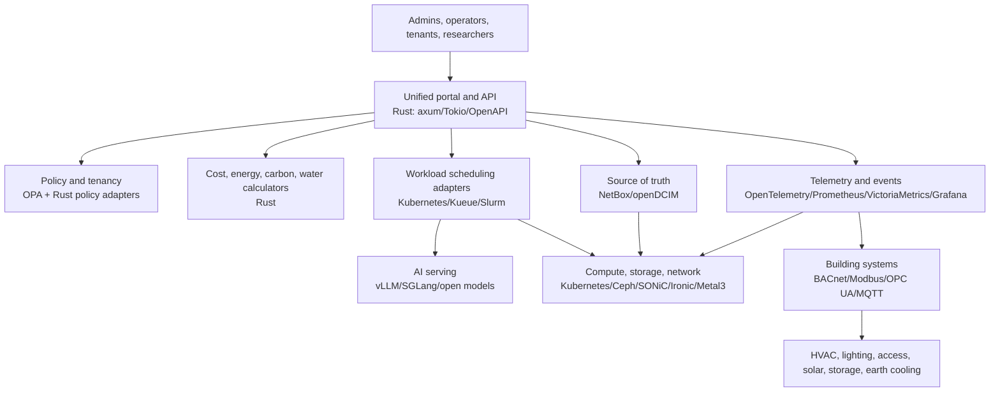

# Reference Architecture

The project is organized as a layered system. The key idea is to keep hazardous or highly specialized control close to the field device, while using Rust services for integration, policy, observability, cost, and user workflows.

## Layer 1: Physical Facility

- Building envelope, structure, earthing, fire zones, cable pathways, service access, and site drainage.
- HVAC, liquid cooling, heat rejection, water-side economizers, ground-source cooling, and optional Cold UTES.
- Solar PV, battery storage, switchgear, UPS, metering, and grid/islanded modes.
- Lighting, access control, CCTV/NVR, intrusion detection, and environmental safety.
- FreeCAD 1.1 source models for parts and assemblies, plus IFC/STEP/STL/PDF exports.

## Layer 2: Rack and Hardware Envelope

Support multiple equipment classes:

- Standard 19-inch racks for globally available servers, network gear, PDUs, and low-cost mixed-vendor deployments.
- Open19 where modular 19-inch sleds and structured rack cabling are useful.
- OCP Open Rack V3 for 21-inch high-density open compute.
- OCP Open Rack Wide for AI-era rack-scale systems when local supply chains can support it.

The mechanical system should model adapters as first-class parts. A country should not be forced into a single rack standard just to participate.

## Layer 3: Infrastructure Runtime

- Bare metal lifecycle: Ironic/Metal3, Redfish, IPMI where unavoidable, OpenBMC where supported.
- Host operating system: Talos Linux or another minimal Kubernetes-focused OS for immutable nodes; general Linux only where workload or hardware support requires it.
- Compute: Kubernetes for service workloads, Kueue for queued batch/AI jobs, Slurm for HPC/training clusters.
- Network: SONiC on qualified switches, Cilium for Kubernetes networking/security, FRRouting/Open vSwitch/OVN where useful.
- Storage: Ceph/Rook as the default shared storage baseline; local NVMe profiles for high-performance scratch and model cache.

## Layer 4: Facility and OT Integration

Building systems should publish data through gateways:

- BACnet/IP for common building automation devices.
- Modbus TCP/RTU for meters, inverters, batteries, and industrial equipment.
- OPC UA for richer industrial data models and secured machine-to-machine access.
- MQTT for telemetry fan-out and lower-power edge devices.
- Project Haystack and Brick-style tags for semantic normalization.

Safety-critical control remains in certified local controllers. The Rust platform supervises, validates, schedules, and alerts.

## Layer 5: Observability and Source of Truth

- NetBox or openDCIM stores planned and actual assets, racks, circuits, IPs, and sites.
- Prometheus/VictoriaMetrics stores metrics.
- OpenTelemetry standardizes traces, metrics, and logs emitted by Rust services.
- Grafana OSS provides dashboards.
- Logs are retained with clear privacy and sovereignty controls.

## Layer 6: Unified Rust Control Plane

The Rust control plane is a set of narrow services:

- `portal-api`: human and machine API for all common actions.
- `inventory-adapter`: reads and reconciles DCIM/IPAM/rack data.
- `telemetry-adapter`: queries metrics and events.
- `facility-adapter`: integrates OT gateways without bypassing safety controls.
- `scheduler-adapter`: allocates compute and AI workloads through Kueue, Slurm, and Kubernetes APIs.
- `calculator`: energy, water, carbon, CAPEX, OPEX, rack-power, storage, AI-job, and autonomy calculations.
- `policy`: OPA-backed access, quota, safety, and procurement policy.

## Layer 7: User Workflows

The first workflows should be intentionally mundane:

- Register a site, rack, PDU, compute node, cooling zone, and meter.
- Estimate rack power and cooling demand.
- Import telemetry and compare measured versus design PUE/WUE/CUE.
- Submit AI inference/training jobs to an open queue.
- Show fair-share queue position, estimated start time, energy cost, and carbon estimate.
- Produce a bill-of-materials and operating-cost summary for a target country/currency.

The interface should be operational, not marketing-shaped: dense, clear, auditable, and quick for repeated use.
