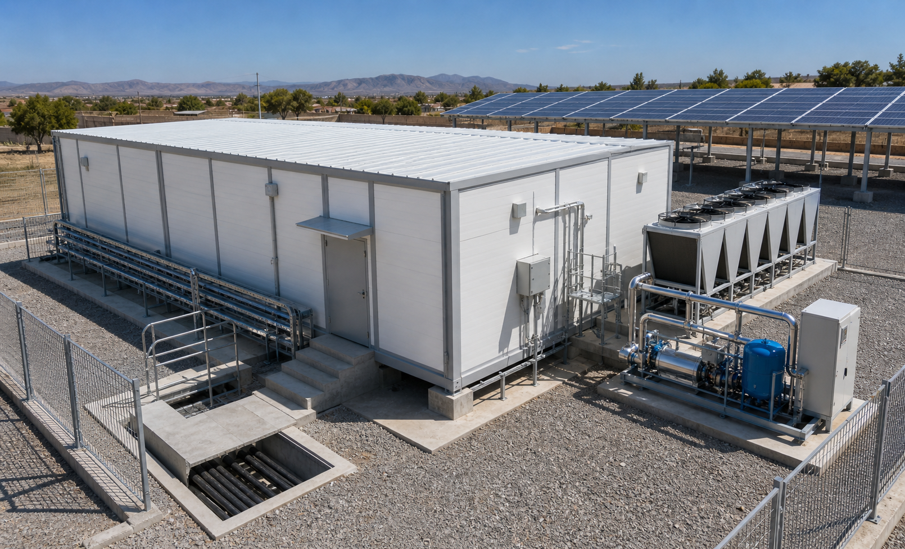
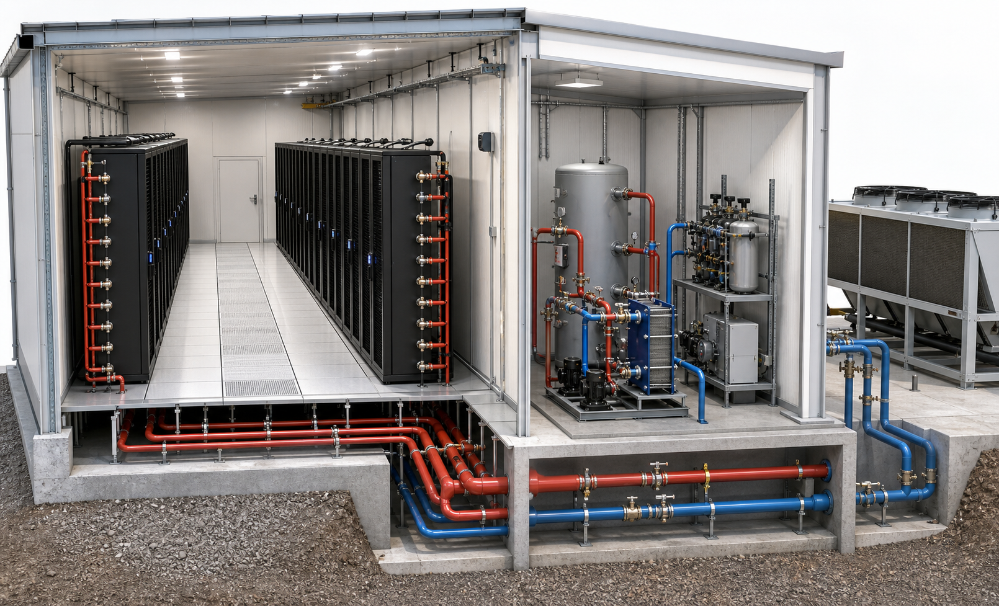

# Alibaba and AliExpress Cost Scenarios

Last reviewed: 2026-06-14.

This is a planning-grade cost model for open-source datacentres assembled from globally available marketplace parts, especially Alibaba and AliExpress. It is not a procurement quote. Final budgets must be repriced with named suppliers, shipping terms, import duty, local taxes, certification, local labour, commissioning, warranty, and spare-parts support.

The recommended building system for all scenarios is a fast-production insulated panel building: pre-cut steel frame, 100-150 mm insulated wall and roof panels, sealed doors, concrete plinth, service trench, and external thermal/electrical plant skids. For fire performance, rockwool panels should be preferred where code or insurer requirements demand non-combustible construction; PIR/PUR panels can be considered where allowed and protected.

## Method

The model separates three cost views:

- Marketplace equipment subtotal: FOB or online listing prices from Alibaba/AliExpress-like sources.
- Landed and installed core: equipment plus freight, customs, local installation, testing, certification, and contingency.
- Starter IT loadout: servers, storage, network, management nodes, and optional GPU nodes.
- Solar sodium-ion DC microgrid: included in the core facility baseline rather than treated as an optional UPS/BESS add-on.

Typical multipliers used:

| Cost family | Marketplace to landed/installed planning multiplier |
| --- | ---: |
| Insulated panels and prefab steel | 2.5x-5.0x, because foundations, flashing, doors, vapour sealing, local labour, and crane time dominate |
| Certified electrical/fire systems | 1.8x-3.0x, because local approval and certified installers matter |
| Cooling plant and pipework | 1.7x-2.8x, because pumps, valves, insulation, flushing, water treatment, and commissioning add up |
| IT and network hardware | 1.2x-1.6x, assuming standard import and modest support spares |
| Solar, sodium-ion BESS, DC/DC converters, boundary rectifiers, and DC protection | 1.5x-2.8x, depending on mounting, DC protection, converter quality, permits, and commissioning |

## Scenario Summary

| Scenario | IT load | Racks | Building area | Core facility with solar sodium-ion DC microgrid | Starter IT cost | Total with IT | Build time |
| --- | ---: | ---: | ---: | ---: | ---: | ---: | ---: |
| Edge micro | 50 kW | 4 | 120 m2 | $340k-$580k | $80k-$220k | $420k-$800k | 8-14 weeks |
| Regional pilot | 250 kW | 10 | 300 m2 | $1.02M-$1.92M | $180k-$550k | $1.20M-$2.47M | 14-24 weeks |
| Regional production | 1 MW | 40 | 1,000 m2 | $3.65M-$6.65M | $0.90M-$3.20M | $4.55M-$9.85M | 28-44 weeks |
| National/AI-ready | 5 MW | 160 | 4,500 m2 | $18.5M-$36.5M | $5.0M-$30.0M | $23.5M-$66.5M | 52-90 weeks |

These totals exclude land purchase, major utility-grid reinforcement, long-haul fibre buildout, unusually high import duties, and financing costs.

## Scenario 1: Edge Micro Datacentre

Target use:

- Local government, university, ISP edge, hospital group, or regional AI inference service.
- 50 kW IT load.
- 4 racks at 8-15 kW average.
- Warm-water thermal spine, rear-door heat exchangers, dry cooler, small backup chiller.
- 75 kWp solar, 150 kWh sodium-ion BESS, 75 kW DC microgrid converter capacity, 380-400 VDC backbone, 48 VDC rack power, and one fallback generator/rental-generator boundary path.

Cost shape:

| Category | Planning range |
| --- | ---: |
| Panel building, civil, trench, security shell | $70k-$130k |
| Solar sodium-ion DC microgrid, fallback generator, DC protection, rack power | $115k-$190k |
| Rack thermal spine cooling | $70k-$140k |
| Fire, access control, CCTV | $30k-$65k |
| Racks, cabling, basic network | $35k-$75k |
| Commissioning, spares, tools, documentation | $45k-$90k |

Build time:

- Design and supplier RFQs: 2-3 weeks.
- Fabrication and shipping: 4-8 weeks.
- Civil/panel assembly: 2-4 weeks.
- MEP install and commissioning: 3-5 weeks.
- Practical overlap means 8-14 weeks if procurement is disciplined.

## Scenario 2: Regional Pilot

Target use:

- First real national/regional open datacentre.
- 250 kW IT load.
- 10 racks, mixed standard compute and a small GPU pilot.
- 300 m2 insulated panel hall with electrical and thermal plant rooms.
- Rack thermal spine, rear-door heat exchangers, direct-to-chip manifold provision, dry cooler, backup chiller, adsorption chiller pilot.
- 300 kWp solar, 500 kWh sodium-ion BESS, 350 kW DC microgrid converter capacity, 380-400 VDC backbone, 48 VDC rack power, and one fallback generator boundary path.

Cost shape:

| Category | Planning range |
| --- | ---: |
| Panel building, civil, trench, perimeter | $160k-$300k |
| Solar sodium-ion DC microgrid, fallback generator, DC protection, rack power | $430k-$720k |
| Rack thermal spine cooling and backup cooling | $230k-$470k |
| Fire, security, monitoring | $70k-$150k |
| Racks, structured cabling, network fabric | $90k-$220k |
| Commissioning, spares, tools, documentation | $90k-$180k |

Build time:

- Engineering and local authority review: 4-6 weeks.
- Supplier RFQ and factory fabrication: 6-10 weeks.
- Shipping/customs: 4-8 weeks.
- Civil and prefab panel assembly: 4-7 weeks.
- MEP install and commissioning: 6-10 weeks.
- With overlap: 14-24 weeks.

## Scenario 3: Regional Production

Target use:

- Sovereign cloud, education/research network, national health data, regional AI services.
- 1 MW IT load.
- 40 racks, likely 20-30 standard racks and 10-20 higher-density liquid-ready racks.
- 1,000 m2 panel building or multiple panel halls around a shared plant yard.
- Multiple thermal spine zones, N+1 pumps, dry coolers, modular chillers, sorption heat-reuse pilot scaled by zone.
- 1.2 MWp solar, 2 MWh sodium-ion BESS, 1.4 MW DC microgrid converter capacity, protected 380-400 VDC distribution, 48 VDC rack power, and a single fallback plant.

Cost shape:

| Category | Planning range |
| --- | ---: |
| Panel building, civil, roads, perimeter, trenches | $550k-$1.10M |
| Solar sodium-ion DC microgrid, fallback plant, DC protection | $1.45M-$2.55M |
| Cooling plant, rack heat capture, thermal spine | $850k-$1.70M |
| Fire, security, monitoring | $180k-$360k |
| Racks, cabling, network fabric | $380k-$750k |
| Commissioning, spares, tools, documentation | $240k-$520k |

Build time:

- Engineering, permits, authority approvals: 8-14 weeks.
- Factory fabrication and shipping: 8-16 weeks.
- Civil, panels, plant pads: 10-18 weeks.
- MEP fit-out: 14-24 weeks.
- Integrated commissioning: 4-8 weeks.
- With overlap: 28-44 weeks.

## Scenario 4: National/AI-Ready Open Datacentre

Target use:

- National digital infrastructure, AI training, high-performance computing, and sovereign cloud.
- 5 MW IT load.
- About 160 racks, depending on density.
- Multiple insulated panel halls or a larger pre-engineered building with panel envelope.
- Medium-voltage boundary plant, 5 MWp solar, 10 MWh sodium-ion BESS, 6 MW DC microgrid converter capacity, one fallback plant, protected DC distribution blocks, multiple thermal spine zones, dry coolers, backup chillers, liquid cooling, and AI-ready network fabric.

Cost shape:

| Category | Planning range |
| --- | ---: |
| Panel buildings, civil campus, roads, security perimeter | $2.5M-$5.0M |
| Solar sodium-ion DC microgrid, MV boundary gear, HVDC protection, single fallback plant | $7.5M-$14.5M |
| Cooling plant and rack thermal spine zones | $4.0M-$8.5M |
| Fire, security, monitoring | $0.7M-$1.6M |
| Racks, structured cabling, network fabric | $2.0M-$4.5M |
| Commissioning, spares, tools, documentation | $1.8M-$3.5M |

Build time:

- Engineering/permitting/procurement: 16-28 weeks.
- Factory fabrication and shipping: 12-24 weeks.
- Civil and building assembly: 20-40 weeks.
- Electrical/cooling fit-out: 28-52 weeks.
- Integrated systems testing: 8-12 weeks.
- With overlap: 52-90 weeks.

At 5 MW, Alibaba/AliExpress sourcing is useful for commodity panels, sensors, racks, DC power shelves, solar components, cable trays, and some IT hardware. It should not be the only procurement path for certified medium-voltage equipment, DC protection gear, fire suppression, fallback generation, DC microgrid converters, sodium-ion BESS, and large chillers.

## Marketplace Price Basis

| Item family | Current marketplace signal | Planning basis used |
| --- | --- | --- |
| 100 mm PU/PIR/PUR insulated panels | Alibaba shows 100 mm PU/PIR panels around $5.87-$6.56/m2 at volume; broader sandwich panel listings show about $6.39-$12.50/m2; Made-in-China examples show about $13-$15/m2. | $8-$18/m2 FOB; $35-$90/m2 installed envelope equivalent after steel, flashing, sealing, freight, and labour |
| 42U racks | Alibaba 42U listings show broad ranges from tens of dollars to several hundred dollars; buyer guides put practical 42U cabinets around $320-$780 mid-tier. | $450-$900 landed per rack |
| 48 VDC rack power shelves or DC PDUs | Marketplace smart PDU pricing gives a low-end signal, but DC shelves need better connectors, fusing, monitoring, and documented power interfaces. | $300-$900 landed per shelf/PDU |
| Legacy UPS reference | Alibaba 100 kVA online UPS listings show roughly $7,710-$37,128. | Kept only as a comparison; the baseline deletes the separate UPS layer |
| 500 kVA diesel generator | Alibaba 500 kVA listings include about $13,999-$25,900 for more plausible sets, with some very low listings that should be treated cautiously. | $30-$80/kVA equipment; higher once fuel, exhaust, pads, ATS, and commissioning are included |
| Dry cooler | Alibaba dry cooler listings include data-centre/immersion cooling dry coolers and group listings around $1,900-$3,800 for smaller/custom units. | $12k-$45k per 250 kW module installed planning range |
| Industrial air-cooled chiller | Alibaba industrial chiller groups show 100-500 kW units around $5,300-$8,600 in some listings. | $20k-$70k per 250 kW module after controls, install, warranty, and selection margin |
| Plate heat exchanger | Alibaba/marketplace examples show small plate heat exchangers from tens to hundreds of dollars. | $1k-$8k per skid-scale heat exchanger module before valves/skid labour |
| Solar panels | Alibaba solar panel listings show about $0.09-$0.20/W at volume. | $0.55-$0.95/W installed PV system planning range |
| Sodium-ion BESS | Alibaba sodium-ion BESS examples list 100 kWh-class systems; supplier catalogues also show 100 kW/215 kWh class C&I sodium-ion systems. | $200-$420/kWh installed planning range until supplier maturity is proven |
| DC microgrid converter/controller | Alibaba PCS and hybrid-inverter listings give a market signal for 100-500 kW converter hardware, but the project should specify DC-coupled MPPT, bidirectional battery DC/DC, and 380-400 VDC bus controls. | $85-$210/kW installed planning range |
| AC boundary rectifier/inverter | Utility and generator input still need certified AC/DC boundary equipment, and export-capable sites may need inverter functions at the boundary. | $55-$150/kW installed planning range |
| HVDC distribution and protection | DC busway/cable bus, DC breakers, fuses, contactors, isolation monitoring, arc-fault detection, and pre-charge circuits are specialist cost items. | $25-$90/kW installed planning range |
| 25G/100G switches | Alibaba 48x25G + 8x100G switch listing showed about $2,228; SONiC-ready 32x100G examples are around $6,429-$7,428. | $3k-$9k per serious datacentre switch, plus optics |
| Commodity servers | Alibaba/used-server guides cite fully tested R740xd-like systems under $1,400, while new dual/GPU-capable servers range far higher. | $1.4k-$3.5k standard compute server; $15k-$50k GPU node |
| AliExpress sensors | AliExpress RS485 Modbus temperature/humidity probes show about $3.85-$13.30; clamp-on/ultrasonic flow discussions suggest practical controllers around $150. | $8-$150 per sensor depending on type and accuracy |

## Procurement Warnings

- Do not buy uncertified fire suppression, switchgear, DC breakers, contactors, arc-fault protection, rectifiers, DC microgrid converters, sodium-ion BESS, or generator control gear purely by lowest Alibaba price.
- Treat suspiciously low generators, batteries, chillers, and solar panels as audit flags.
- Require test reports, serial-number traceability, factory acceptance photos/videos, wiring diagrams, certifications, and spare-parts lists.
- Use inspection services for high-value shipments.
- Prefer DDP/DDU quotes only when the supplier clearly states what is included.
- Keep 10-20% spare budget for customs delays, damaged shipments, missing accessories, and local rework.
- For panels, specify core material, fire rating, thickness, steel skin thickness, joint detail, roof load, wind load, corrosion coating, and fastener system.
- For the DC power system, specify voltage class, fault current, isolation method, polarity labelling, pre-charge behavior, emergency disconnect behavior, arc-flash study assumptions, and local electrical-code acceptance.

## Generated Images

The project image assets were generated with the built-in image generation tool and saved to:

- [prefab-panel-datacentre-exterior-01.png](../assets/prefab-panel-datacentre-exterior-01.png)
- [prefab-panel-datacentre-exterior-02.png](../assets/prefab-panel-datacentre-exterior-02.png)
- [rack-thermal-spine-cutaway.png](../assets/rack-thermal-spine-cutaway.png)

Prompts emphasized fast-production insulated metal sandwich panels, practical developing-world deployment, solar canopy, dry cooler, thermal plant skid, and rack thermal spine cooling.

## Sources

- Alibaba 100 mm PU/PIR sandwich panel listing: https://www.alibaba.com/product-detail/100mm-Thick-PU-PIR-Sandwich-Panel_1601730518246.html
- Alibaba sandwich panel pricing search: https://www.alibaba.com/countrysearch/CN/sandwich-panel-price.html
- Alibaba 42U server rack search: https://www.alibaba.com/countrysearch/CN/42u-server-rack.html
- Alibaba 19-inch rack buyer guide: https://electronics.alibaba.com/buyingguides/19-inch-rack-guide-what-you-actually-need-to-know
- Alibaba 100 kVA UPS search: https://www.alibaba.com/countrysearch/CN/100kva-online-ups.html
- Alibaba sodium-ion 100 kWh BESS example: https://www.alibaba.com/product-detail/Sodium-ion-Battery-Energy-Storage-System_1601037819096.html
- Highjoule sodium-ion C&I BESS configurations: https://www.highjoule.com/products/ciess/sodium-ion/
- Alibaba 150/250/500 kW ESS PCS example: https://www.alibaba.com/product-detail/150kW-250kW-500kW-ESS-PCS-Energy_1601350398188.html
- Alibaba 500 kW bidirectional PCS example: https://www.alibaba.com/product-detail/500kw-Pcs-Bidirectional-Dc-ac-Converter_1601174426937.html
- OCP Rack and Power project: https://www.opencompute.org/community/rack-and-power
- OCP Rack and Power specifications: https://www.opencompute.org/wiki/Open_Rack/SpecsAndDesigns
- ETSI EN 300 132-3 400 VDC ICT power interface: https://www.etsi.org/deliver/etsi_en/300100_300199/30013203/02.03.01_60/en_30013203v020301p.pdf
- LBNL/EMerge Alliance 380 VDC datacentre architecture work: https://datacenters.lbl.gov/sites/default/files/380VdcArchitecturesfortheModernDataCenter.pdf
- Alibaba 500 kVA generator pricing search: https://www.alibaba.com/countrysearch/CN/500-kva-diesel-generator-price.html
- Alibaba dry cooler group listing: https://vrcooler.en.alibaba.com/productgrouplist-806311006/Dry_cooler.html
- Alibaba 250 kW data-centre dry cooler listing: https://www.alibaba.com/product-detail/Copper-Tube-Aluminum-Fin-Dry-Cooler_1601789907482.html
- Alibaba industrial chiller listing group: https://megatechnology.en.alibaba.com/productgrouplist-821215510/Industrial_water_chillers.html
- Alibaba solar panel pricing search: https://www.alibaba.com/countrysearch/CN/china-solar-panel-prices.html
- GLCE 215 kWh C&I cabinet public price: https://glceenergy.com/products/glce-215kwh-100kw-solar-diesel-industrial-and-commercial-energy-storage-cabinet
- AliTools AliExpress RS485 Modbus temperature/humidity probe: https://alitools.io/en/showcase/rs485-modbus-waterproof-temperature-humidity-sensor-probe-1005001404952412
- Alibaba 48-port switch search: https://www.alibaba.com/countrysearch/CN/48-port-switch.html
- SONiC-ready 32-port 100G switch reference: https://asteraix.com/product/32-port-100g-qsfp28-aggregation-switch-enterprise-sonic-ready/
- Alibaba used-server guide: https://electronics.alibaba.com/buyingguides/used-servers-from-china-a-practical-buyer%E2%80%99s-guide
