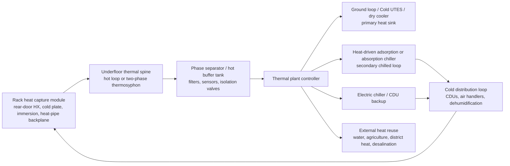

# Rack Thermal Spine Cooling

The cooling system is the primary technical differentiator of this project. The design target is a low-cost, maintainable system that captures heat at each rack, moves it through an underfloor or service-trench thermal spine, and reuses as much of that heat as possible before rejecting the unavoidable remainder to ground, air, water, or another useful load.

The important thermodynamic constraint is simple: rack heat cannot be recycled into cooling with 100% self-cancellation. Heat-driven cooling can reduce compressor electricity and provide useful chilled water, but the system must still reject heat to a sink. The design should therefore cascade heat through the most useful paths first.

## Design Intent

1. Capture heat as close to the rack as possible.
2. Move heat through a modular underfloor/service-trench thermal spine.
3. Use warm-water or two-phase transport to reduce pump power.
4. Reuse heat for cooling through sorption chillers when the temperature is high enough.
5. Prefer components that can be fabricated, serviced, or substituted locally.
6. Keep mechanical backup and bypass paths because cooling is mission-critical.

## Reference Architecture



## Rack Heat Capture Module

Each rack should expose a standard thermal interface independent of the compute vendor:

- Air-cooled gear: rear-door heat exchanger or heat-pipe backplane that captures hot exhaust without forcing proprietary servers.
- Direct-to-chip gear: rack manifold with dry-break couplings, leak detection, and a facility-water heat exchanger.
- Immersion gear: tank heat exchanger connected to the same hot thermal spine.
- Hybrid gear: air capture for residual heat plus cold-plate capture for CPUs/GPUs.

The rack module should measure:

- Supply and return temperature.
- Flow rate or two-phase vapor/liquid state.
- Pressure and differential pressure.
- Leak state.
- Rack power.
- Valve position.
- Capture fraction estimate.

## Underfloor Thermal Spine

The "underfloor heatpipe" should be modelled as a thermal spine, not one fragile monolithic pipe. Two practical forms are allowed:

1. Warm-water/glycol spine
   - Lowest manufacturing risk.
   - Uses ordinary pipework, pumps, strainers, valves, and plate heat exchangers.
   - Good for direct-to-chip, immersion secondary loops, rear-door heat exchangers, and heat reuse.

2. Two-phase thermosyphon or loop heat-pipe spine
   - Lower pump power and high heat-transfer density.
   - More sensitive to elevation, working fluid, charge, containment, and service practice.
   - Best as a modular cassette per row or pod, not as a site-wide unserviceable loop.

The spine may run under a raised floor, in a shallow service trench, or in an overhead tray. Underfloor is useful for modularity and protection, but modern high-density liquid-cooled sites often avoid raised floors. The design should support both.

## Thermal Plant Priority Order

The plant should route heat in this order:

1. Direct free rejection
   - Dry cooler, water-side economizer, ground loop, or Cold UTES when conditions allow.
   - Usually the highest efficiency path.

2. Useful heat reuse
   - Domestic hot water, nearby buildings, greenhouses, drying, desalination preheat, or absorption/adsorption drive heat.

3. Heat-driven cooling
   - Adsorption or absorption chiller uses captured rack heat to make chilled water for residual room cooling, dehumidification, or adjacent loads.
   - This offsets electric chiller power but increases the total heat that must be rejected at the chiller condenser/adsorber.

4. Heat pump boost
   - If rack return temperature is too low, a heat pump can lift it into the sorption chiller operating window.
   - This may still beat direct electric chilling when solar, ground storage, or high rack temperatures are available.

5. Backup mechanical cooling
   - Must cover full critical load during maintenance, fouling, low heat-drive temperature, or failed thermal-reuse paths.

## Heat-Driven Cooling Options

| Option | Recommended role | Typical drive temperature | Strengths | Risks |
| --- | --- | --- | --- | --- |
| Adsorption chiller | Baseline low-grade heat-to-cooling path | Roughly below 100 C, with many practical systems in the 50-95 C range | Few moving parts, can use water/silica gel/zeolite-style pairs, good fit for warm liquid cooling and solar thermal assist | Lower COP, larger heat exchangers, cyclic operation, sorbent selection matters |
| Single-effect absorption chiller | Baseline where 70-95 C or boosted heat is available | Commonly around 70 C+ for LiBr-water systems | Mature, scalable, useful chilled-water production | Vacuum/corrosion control, crystallization risk, water treatment, needs heat rejection |
| Ejector chiller | Low-cost research/pilot path | Depends strongly on working fluid and lift | Mechanically simple | Lower COP and sensitive to operating conditions |
| Thermoacoustic refrigerator | Research path for low-maintenance heat-driven cooling | Emerging; depends on design | Few or no moving parts, potentially manufacturable | Not yet a proven low-cost datacentre baseline |
| Heat-driven Stirling refrigerator | Research path, not baseline | Published direct-coupled work used much higher drive temperatures than rack waste heat | Compact and elegant in principle | Rack heat is generally too low-grade; cryocoolers usually target temperatures far colder than datacentres need |

For 2027+ open deployments, the baseline should be adsorption/absorption, with Stirling or thermoacoustic modules as an experimental open-hardware workstream.

## Example Sizing

For 20 racks at 40 kW each:

```text
Rack heat = 800 kW
Capture fraction = 0.85
Captured heat = 680 kW
Adsorption thermal COP = 0.45
Cooling generated = 306 kW thermal
If displaced electric chiller COP = 4.0
Avoided compressor electricity = 76.5 kW
If pumps/controls = 12 kW
Net electric reduction = 64.5 kW
Heat rejected at sorption condenser/adsorber ~= 986 kW
```

This does not cool the whole datacentre "for free." It reduces the electrical cooling burden and turns otherwise rejected heat into useful cooling. The heat sink must still be designed for the combined rejected heat.

## Low-Cost Manufacturing Approach

Prioritize:

- Brazed-plate heat exchangers.
- Standard copper, stainless, PEX-AL-PEX, or HDPE where compatible with pressure and coolant.
- Flanged or grooved pipe sections.
- Locally replaceable pumps and VFDs.
- Open manifolds with documented thread/coupling standards.
- Sensors with Modbus, 4-20 mA, or open digital interfaces.
- Insulated hot and cold loops with visible leak channels.
- Modular sorption beds or chiller cassettes that can be isolated without shutting down the whole plant.

Avoid:

- Proprietary rack couplings without second-source equivalents.
- Refrigerant-filled underfloor systems without trained local service capacity.
- Single large thermal loops with no isolation valves.
- Cryogenic Stirling devices for normal server cooling targets.

## Safety and Commissioning

Minimum requirements:

- N+1 pumps or passive bypass for every critical thermal path.
- Leak detection in each rack, trench section, and plant skid.
- Pressure relief, expansion volume, vacuum breakers where needed, and drain/fill points.
- Isolation valves at every rack, row, and plant module.
- Water chemistry plan for corrosion, biological growth, freezing, and galvanic compatibility.
- Thermal runaway/fail-hot test with staged rack load.
- Black-start and power-loss behavior test.
- Conservative fallback to backup cooling on bad sensor data.

## FreeCAD Work Packages

Create FreeCAD 1.1 models for:

- Rack heat-capture rear-door module.
- Rack hot/cold manifold with standard coupling plates.
- Underfloor/service-trench thermal spine segment.
- Row isolation valve and sensor cassette.
- Phase separator or hot buffer tank.
- Plate heat-exchanger skid.
- Adsorption/absorption chiller placeholder envelope.
- Dry cooler and ground-loop manifold interfaces.

Each model must export STEP, IFC where building coordination is needed, and a CSV BOM for calculator ingestion.

## Open Questions

- Best working fluid for a low-cost two-phase row module by climate, regulation, and local service skill.
- Whether the first prototype should be warm-water only, with two-phase spine as phase 2.
- Minimum useful rack return temperature for sorption cooling without heat-pump boosting.
- Field-maintainable adsorption bed design and sorbent sourcing.
- How to integrate ground thermal storage without seasonal heat saturation.

## Source Notes

- OCP Cooling Environments lists cold plate, CDU, immersion, door heat exchanger, and heat reuse as focus areas: https://www.opencompute.org/community/cooling-environments
- LBNL liquid-cooled rack specification work highlights reusable, multi-vendor rack infrastructure parameters such as fluid, pressure, temperature, flow, headers, and connections: https://datacenters.lbl.gov/development-liquid-cooled-rack-specification
- Heat-driven adsorption chillers can use low-grade heat below 100 C and are discussed for hot-water cooled datacentres: https://heatpumpingtechnologies.org/publications/heat-driven-adsorption-chiller-systems-for-sustainable-cooling-applications/
- A 2025 systematic review describes absorption/adsorption cooling as a likely pathway for low-grade datacentre heat around 50-95 C: https://www.mdpi.com/2071-1050/17/22/10101
- A 2014 review identifies absorption refrigeration and ORC as promising datacentre waste-heat reuse technologies, while emphasizing that the heat is low quality: https://files.ifi.uzh.ch/hilty/t/Literature_by_RQs/RQ%20104/2014_Ebrahimi_Jones_Fleischer_A_Review_of_data_center_cooling_technology.pdf
- A 2025 thermosyphon review covers two-phase datacentre rack cooling and heat recovery layouts: https://link.springer.com/article/10.1186/s44147-025-00833-3
- Heat-driven Stirling refrigeration is feasible in research, but one tested direct-coupled system used 250 C heating and produced 363 W at COP 0.17, making it a research path rather than a low-grade rack-heat baseline: https://pubs.aip.org/aip/apl/article/124/12/123905/3278014/Experimental-and-numerical-study-on-a-heat-driven
- Thermoacoustic-Stirling refrigeration can be thermally driven without moving parts, but remains an experimental direction for this use case: https://pubmed.ncbi.nlm.nih.gov/16979679/
