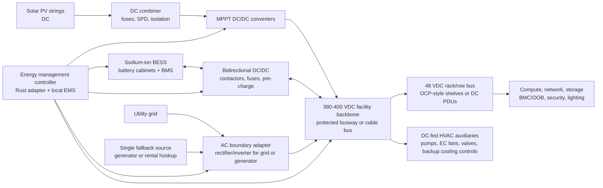

# Solar Sodium-Ion DC Microgrid Power Architecture

This project should use a DC-first solar and sodium-ion battery energy system instead of a conventional UPS-first AC topology. The goal is to keep the steady-state power path DC from solar PV through storage, facility distribution, rack power, network equipment, controls, and cooling auxiliaries.

AC is still useful at the site boundary because utilities and generators are usually AC. Inside the datacentre, the preferred model is:

- Solar PV DC into MPPT DC/DC converters.
- Sodium-ion BESS on a protected bidirectional DC/DC interface.
- A `380-400 VDC` facility backbone for efficient distribution.
- `48 VDC` rack and row buses for compute, network, controls, and serviceable low-voltage equipment.
- Local `24 VDC`, PoE, or device-specific DC conversion only where needed.
- AC/DC rectifier-inverter equipment only at the utility, generator, or export boundary.

What many suppliers call a hybrid inverter or PCS should be specified as a DC-coupled microgrid controller, MPPT stage, bidirectional battery converter, and boundary AC adapter. It must not force the whole facility back into an internal AC critical bus.

## Target Topology

## Voltage Strategy

Use two main DC layers:

| Layer | Target | Purpose |
| --- | --- | --- |
| Facility backbone | `380-400 VDC` | Lower-current distribution from PV, BESS, boundary rectifiers, and plant skids. Aligns with 380/400 VDC datacentre and ICT power-interface work. |
| Rack and row bus | `48 VDC` nominal | Practical, serviceable rack power for mixed compute, OCP-style equipment, network, controls, and telecom-derived devices. |
| Local control rails | `24 VDC`, PoE, or device-specific DC | Door controllers, sensors, lighting drivers, valve actuators, small controllers, and cameras. |

The 400 VDC layer should be treated as hazardous energy equipment. It needs certified switchgear, DC-rated breakers and fuses, isolation monitoring, emergency disconnects, pre-charge circuits, labelled polarity, and commissioning tests.

## DC-Powered Loads

The design target is that all critical loads are supplied by DC buses:

- Compute racks use 48 VDC rack power shelves or metered DC PDUs feeding server power shelves.
- Network switches, OOB switches, routers, console servers, and storage shelves should use native 48 VDC options where available.
- BMC, sensors, lighting, CCTV, access control, and small controllers use 48 VDC, 24 VDC, or PoE derived from the rack/row bus.
- Cooling pumps use DC-fed VFDs, BLDC drives, or EC motor controllers.
- Dry cooler and heat-exchanger fans use EC/DC fan arrays where available.
- Valves, leak detection, controls, adsorption-chiller controls, and thermal-spine instrumentation use low-voltage DC.
- Backup electric chillers or DX modules should be procured as DC-bus-compatible inverter compressor systems where possible. Where only AC equipment is available, the exception must be explicit and isolated at the plant skid.

## Operating Modes

1. Normal solar-first operation
   - Solar PV serves the 380-400 VDC bus through MPPT DC/DC converters.
   - Sodium-ion BESS holds a protected reserve and absorbs solar surplus.
   - Utility power, when available, enters through the boundary rectifier only as needed.

2. Grid outage
   - The DC backbone remains live from sodium-ion BESS.
   - Non-critical compute queues and deferrable charging shed automatically.
   - If outage exceeds the battery autonomy policy, the single fallback source starts and feeds the DC bus through the boundary rectifier.

3. Solar surplus
   - Charge sodium-ion BESS.
   - Pre-cool thermal mass or increase battery reserve.
   - Run deferrable AI/batch workloads if policy allows and thermal capacity is available.

4. Low battery reserve
   - Shed non-critical compute queues and non-essential HVAC comfort loads.
   - Pause low-priority AI jobs.
   - Start fallback source before critical reserve is exhausted.

## Why Sodium-Ion

Sodium-ion remains attractive for this project because it fits stationary storage:

- Lower reliance on lithium, nickel, and cobalt supply chains.
- Good fit where space and weight are less constrained than in EVs.
- Better tolerance for low temperatures than many lithium systems.
- Potentially safer chemistry profile and simpler long-term storage handling.
- Suitable for daily cycling behind solar PV once supplier maturity is proven.

The tradeoff is lower energy density and a still-maturing supplier ecosystem. That is acceptable for a fixed datacentre yard, but every sodium-ion BESS must be validated by factory tests, certifications, warranty terms, BMS data access, and local service capability.

## Single Fallback System

The fallback system should be one source feeding the DC bus, not a duplicated UPS/generator chain:

- Edge and 250 kW sites: one generator sized for critical IT plus cooling fallback, with a rental-generator quick-connect and boundary rectifier.
- 1 MW and larger sites: one fallback plant may contain multiple paralleled generator modules for serviceability, but it remains one fallback path rather than 2N utility/generator/UPS duplication.
- Always include a rental generator connection because it is often cheaper than owning full redundancy.

## Service-Level Controls

To maintain service levels without a conventional UPS:

- Keep a protected battery reserve, for example 20-40% SOC depending on outage risk.
- Classify loads as `critical`, `deferable`, and `shed`.
- Feed IT racks, BMS controls, network, security, and cooling pumps from the DC backbone or 48 VDC rack/row bus.
- Move office HVAC, workshops, battery fast charging, and low-priority AI queues to shed/deferable DC branches.
- Use scheduler policy to pause batch/AI workloads before battery reserve is at risk.
- Require black-start tests from sodium-ion BESS and fallback source.
- Require DC-bus ride-through validation under staged IT and cooling load before production.

## Procurement Requirements

For sodium-ion BESS:

- Sodium-ion chemistry clearly stated at cell and pack level.
- Usable kWh, rated kW, cycle life, warranty, depth-of-discharge limits, and temperature range.
- BMS access through Modbus, CAN, or documented API.
- Fire test data and local authority acceptance.
- Shipping state and long-term storage instructions.
- Spare BMS modules, contactors, fuses, fans, sensors, and cabinet controllers.

For DC microgrid equipment:

- MPPT DC/DC input range for the selected PV string design.
- Bidirectional battery DC/DC interface with pre-charge and isolation.
- 380-400 VDC output regulation, droop/current sharing, fault ride-through, and black-start behavior.
- Generator and grid boundary rectifier support.
- DC-rated breakers, fuses, contactors, disconnects, surge protection, isolation monitoring, and arc-fault detection.
- Parallel operation and service isolation by module.
- Remote control over open or documented protocols.

## Validation Tests

- Full-load grid-loss test with no interruption to the 48 V rack bus.
- Generator-start and boundary-rectifier synchronization test.
- Solar-cloud transient test.
- Battery-low load-shed test.
- Black-start from BESS.
- Black-start from fallback generator through the boundary rectifier.
- DC polarity, insulation-resistance, isolation-monitoring, breaker coordination, and emergency-disconnect tests.
- Power-quality and ripple measurement at the 380-400 VDC backbone and 48 V rack bus.
- Thermal test for sodium-ion cabinets in local climate.

## Cost Implication

The expected saving is not from deleting batteries. The saving comes from avoiding a separate UPS layer and reducing repeated AC/DC/AC conversions:

- solar integration,
- ride-through,
- power conditioning,
- peak shaving,
- outage support,
- and load-shed orchestration.

This reduces duplicated rectifiers, battery strings, bypass panels, and maintenance contracts. It increases dependence on DC protection, controls, commissioning, and supplier quality, so those parts are not optional.

## Source Notes

- OCP Rack and Power project: https://www.opencompute.org/community/rack-and-power
- OCP Rack and Power specifications, including Open Rack V3 material: https://www.opencompute.org/wiki/Open_Rack/SpecsAndDesigns
- OCP Open Rack V3 BBU shelf specification shows 48 V rack-level battery output and Modbus monitoring patterns: https://www.opencompute.org/documents/open-rack-v3-bbu-shelf-spec-rev1-1-pdf-1
- ETSI EN 300 132-3 covers up-to-400 VDC ICT equipment power interfaces: https://www.etsi.org/deliver/etsi_en/300100_300199/30013203/02.03.01_60/en_30013203v020301p.pdf
- LBNL/EMerge Alliance 380 VDC architecture work: https://datacenters.lbl.gov/sites/default/files/380VdcArchitecturesfortheModernDataCenter.pdf
- Alibaba sodium-ion C&I BESS examples include 100 kWh-class systems: https://www.alibaba.com/product-detail/Sodium-ion-Battery-Energy-Storage-System_1601037819096.html
- Highjoule sodium-ion C&I systems list 60 kW/115-125 kWh and 100 kW/215 kWh configurations: https://www.highjoule.com/products/ciess/sodium-ion/
- Volta Foundation 2026 sodium-ion assessment describes sodium-ion as moving toward high TRL and highlights grid-scale storage deployments: https://volta.foundation/assessing-the-promise-and-potential-of-sodium-ion-batteries-in-2026/
